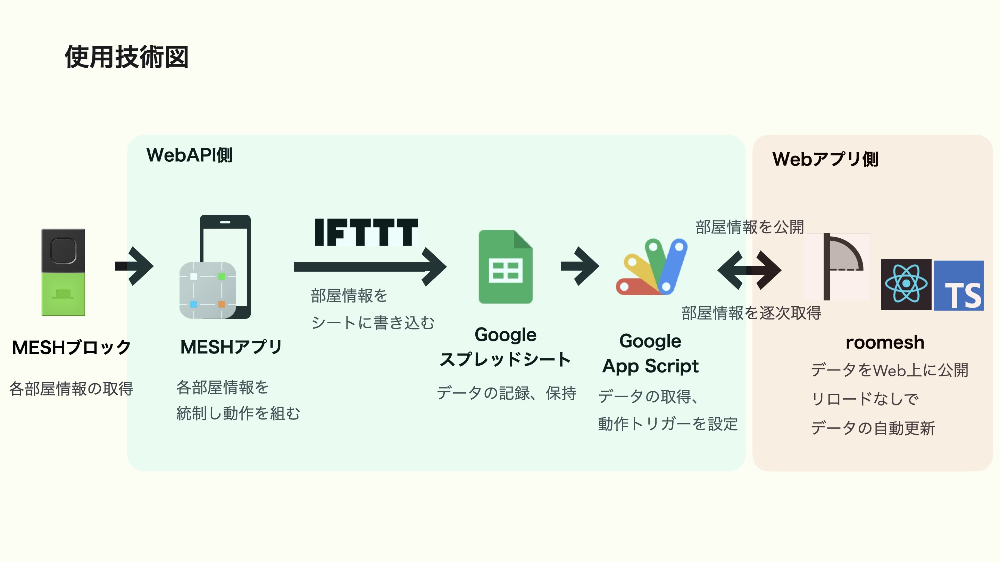

# roomesh
IoTデバイスキット「MESH」を活用した
 
常時表示型インフォメーションディスプレイのWebアプリ

## MESHとは
SONYの提供する、ブロック型の無線IoTセンサーデバイス。
 
専用のアプリを介して独自の機能を実装することができます。

MESH：小さな便利を形にできる、IoTブロック｜ソニー
 
https://meshprj.com/jp/feature/index.html

## 何を作ったのか
MESHを何かに活用できないかと考え、
MESHより部屋の情報を収集し、部屋情報WebAPIを公開。
 
部屋情報WebAPIから情報を逐次取得するWebアプリを作成し、
MESHをおいた部屋の情報をどこからでも確認できるWebアプリを作成しました。
 

図で詳しく表したものが以下です。
 

ドキュメントは以下です。
 

MESHアプリ仕様書 - Google ドキュメント
 
https://docs.google.com/document/d/1g5y_MGJf_vFQ9Uh8pJ3wQpNNDPEaSZjoISPBvwj-aSI/edit?usp=sharing